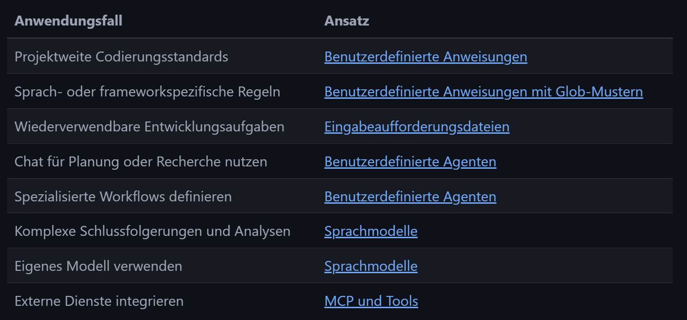

# Herangehensweise

> HINWEIS: \
> OPUS 4.x: für komplexere Coding- & Architekturaufgaben \
> Sonnet 4.x: für gängige Aufgaben im Coding-Umfeld \
> Sonnet Haiku: für einfache Aufgaben wie Dokumentation \
> RESEARCH: hier sollten immmer externe Tools wie Claude AI/Google Gemini oder GPT5 genutzt werden, wegen den DeepResearch Funktionen!

1. **Visual Studio Code konfigurieren**
  - GH Copilot Extension installierne & konfigurieren
  - Darauf achten nicht alle Tools zu aktivieren (`Configure Tools`) - nur das was Ihr täglich nutzt!
  - Darauf achten das der Github Copilot Admin in regelmäßigen Abständen die neuesten KI-Modelle aktiviert (nur manuell möglich!) - veraltete Modell deaktivieren (damit nicht versehentlich genutzt)!

2. **Abhängigkeiten installieren**
   - Github MCP für Interaktion mit Github-Funktionen, siehe https://docs.github.com/en/copilot/how-tos/provide-context/use-mcp/use-the-github-mcp-server
   - Sollte Azure DevOps genutzt werden, dann diese extension nutzen: https://github.com/microsoft/azure-devops-mcp
   - EMPFEHLUNG MCP: Github/Azure DevOps, [Context7](https://github.com/upstash/context7)
   - !! NICHT wild MCP-Extensions installieren: benötigen viel Kontext (Tokens) in jedem Prompt!

3.**Grundkenntnisse zu GH Copilot Prompts & Instructions erlernen**
   -  https://developer.microsoft.com/blog/introducing-awesome-github-copilot-customizations-repo
   - https://code.visualstudio.com/docs/copilot/customization/overview#_use-instructionsmd-files
   - https://docs.github.com/en/copilot/tutorials/copilot-chat-cookbook

4. **Nutze GH-Prompt & Instructions Beispiele**
   - https://github.com/github/awesome-copilot

> **WICHTIG: alle diese Prompt-/Chatvorlagen, als auch MCP-Erweiterungen verbrauchen sehr viel Kontext (Input-Tokens). Daher spezifische Prompts, für spezifische Aufgaben nutzen und NICHT alles in die globalen Projekt-Instructions ablegen! Jeder Promptverlauf ist limitiert auf das Kontext-Window, basierend auf dem LLM das Ihr nutzt (GPT5.1/Sonnet4.5/Gemini ..)**

---

# Good-to-Know

`Benutzerdefinierte Anweisungen (Custom instructions):` .github/copilot-instructions.md
- Benutzerdefinierte Anweisungen definieren,  wie  Aufgaben ausgeführt werden sollen. Zum Beispiel, welche Technologien bevorzugt werden. Oder worauf bei einer Codeüberprüfung geachtet werden soll.
- Markdown Format ist erforderlich
- Beispiele: https://github.com/github/awesome-copilot/blob/main/docs/README.instructions.md
``

---

`Benutzerdefinierte Prompts (Custom prompts):` .github/copilot-instructions.md
- Fokussierte, aufgabenspezifische Eingabeaufforderungen zum Generieren von Code, Dokumentation und zum Lösen spezifischer Probleme im Chat-Modus (Prompting). Diese werden über den `/<dein prompt-file-name>` aufgerufen
- Markdown Format ist erforderlich, hier ist aber zu beachten das spezielle Header-Parameter angegeben werden können (Modi, Tools, Model)
- Beispiele: https://github.com/github/awesome-copilot/blob/main/docs/README.prompts.md

---

`Benutzerdefinierte Chat-Modi (Custom chat modes):` .github/copilot-instructions.md
- Spezialisierte KI-Personas und Konversationsmodi für verschiedene Rollen (Bsp. Architekt, Coder..) und Kontexte
- !! Diese sollten erst angewendet werden, wenn hoher Reifegrad mit Instructions & Prompts erreicht wurden
- Beispiele: https://github.com/github/awesome-copilot/blob/main/docs/README.chatmodes.md

---

`Benutzerdefinierte Agenten (Custom Agents):`
- Spezialisierte GitHub Copilot-Agenten, die sich in MCP-Server integrieren, um erweiterte Funktionen für bestimmte Workflows und Tools bereitzustellen
- !! Diese sollten erst angewendet werden, wenn hoher Reifegrad mit Instructions & Prompts erreicht wurden
- Beispiele: https://github.com/github/awesome-copilot/blob/main/docs/README.agents.md

---

**Anwendungsszenarien:**

[Link](https://code.visualstudio.com/docs/copilot/customization/overview#_usage-scenarios)

---

# GH CoPilot Tips & Tricks

- Nutzung des `@` Erwähnungen, gilt auch für hinzufügen von relevanten Kontext
  - Bsp: kompletten Code prüfen: `@workspace erkläre die Code-Base` - hier wird nicht alles eingelesen, sondern basiert auf den Projekt-Index (ansonsten Kontext-Problem)
- Nutzung des `/` Slash-Befehle im Chatfeld nutzen
- Nutzung des `#` für Dateinamen Angaben
- 